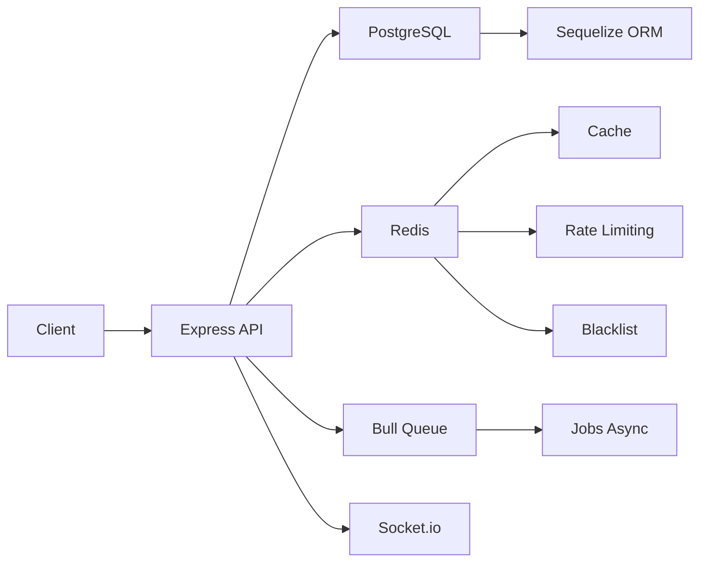

# 🎵 Djorssi Express - Plateforme de mise en relation DJs & Employeurs

> **Version**: 1.0.0  
> **Statut**: 🟢 Production Ready  
> **Licence**: MIT

---

## 📋 Table des matières

1. [Présentation](#-présentation)
2. [Fonctionnalités](#-fonctionnalités)
3. [Architecture Technique](#-architecture-technique)
4. [Installation](#-installation)
5. [Configuration](#-configuration)
6. [Base de données](#-base-de-données)
7. [API Routes](#-api-routes)
8. [Système de Permissions](#-système-de-permissions)
9. [Fonctionnalités Avancées](#-fonctionnalités-avancées)
10. [Sécurité](#-sécurité)
11. [Tests](#-tests)
12. [Déploiement](#-déploiement)
13. [Documentation Technique](#-documentation-technique)
14. [Dépannage](#-dépannage)
15. [Contribution](#-contribution)
16. [License](#-license)

---

## 🎯 Présentation

**Djorssi Express** est une plateforme web complète qui révolutionne la mise en relation entre **DJs (djorssi)** et **employeurs** pour la gestion de missions musicales.

### Problématique résolue

| Problème                                              | Solution Djorssi Express                           |
| ----------------------------------------------------- | -------------------------------------------------- |
| Difficulté pour les DJs à trouver des missions        | Marketplace de missions avec filtres et catégories |
| Processus de recrutement complexe pour les employeurs | Publication simplifiée et gestion des candidatures |
| Manque de transparence sur la qualité des DJs         | Système d'avis et d'évaluations                    |
| Sécurité et confiance entre les parties               | Vérification d'identité et système de notation     |
| Gestion des paiements compliquée                      | Suivi intégré des paiements                        |
| Communication inefficace                              | Notifications en temps réel                        |

### Public cible

| Rôle                | Description                                           |
| ------------------- | ----------------------------------------------------- |
| **DJs (djorssi)**   | Artistes musicaux cherchant des missions              |
| **Employeurs**      | Organisateurs d'événements, particuliers, entreprises |
| **Administrateurs** | Gestion et modération de la plateforme                |

---

## ✨ Fonctionnalités

### 🔐 Authentification & Comptes

| Fonctionnalité             | Description                                    |
| -------------------------- | ---------------------------------------------- |
| Inscription                | Création de compte avec validation des données |
| Connexion                  | Authentification sécurisée avec JWT            |
| Rafraîchissement token     | Refresh token pour sessions prolongées         |
| Déconnexion                | Invalidation du token                          |
| Profil                     | Gestion des informations personnelles          |
| Changement de mot de passe | Sécurisé avec validation                       |

### 🎯 Gestion des Missions

| Fonctionnalité         | DJ  | Employeur | Admin |
| ---------------------- | --- | --------- | ----- |
| Consulter les missions | ✅  | ✅        | ✅    |
| Filtrer les missions   | ✅  | ✅        | ✅    |
| Créer une mission      | ❌  | ✅        | ✅    |
| Modifier une mission   | ❌  | ✅        | ✅    |
| Supprimer une mission  | ❌  | ✅        | ✅    |
| Publier une mission    | ❌  | ✅        | ✅    |
| Postuler à une mission | ✅  | ❌        | ❌    |
| Gérer les candidatures | ❌  | ✅        | ✅    |
| Sélectionner des DJs   | ❌  | ✅        | ✅    |
| Confirmer des DJs      | ❌  | ✅        | ✅    |

### 📝 Candidatures

| Fonctionnalité          | DJ  | Employeur | Admin |
| ----------------------- | --- | --------- | ----- |
| Postuler                | ✅  | ❌        | ❌    |
| Annuler une candidature | ✅  | ❌        | ❌    |
| Voir les candidatures   | ✅  | ✅        | ✅    |
| Accepter/Refuser        | ❌  | ✅        | ✅    |
| Évaluer un DJ           | ❌  | ✅        | ✅    |
| Gérer les paiements     | ❌  | ✅        | ✅    |

### 🏷️ Catégories

- **Catégories** : Soirée, Mariage, Concert, Corporate, Anniversaire, etc.
- **Sous-catégories** : Organisation hiérarchique
- **Filtrage** : Recherche par catégorie
- **Gestion admin** : CRUD complet

### ⭐ Avis & Évaluations

| Fonctionnalité     | DJ  | Employeur | Admin |
| ------------------ | --- | --------- | ----- |
| Donner un avis     | ✅  | ✅        | ✅    |
| Répondre à un avis | ✅  | ✅        | ❌    |
| Consulter les avis | ✅  | ✅        | ✅    |
| Modérer les avis   | ❌  | ❌        | ✅    |

### 💰 Paiements

| Fonctionnalité          | DJ  | Employeur | Admin |
| ----------------------- | --- | --------- | ----- |
| Créer un paiement       | ❌  | ✅        | ✅    |
| Consulter les paiements | ✅  | ✅        | ✅    |
| Valider un paiement     | ❌  | ❌        | ✅    |
| Suivi des paiements     | ✅  | ✅        | ✅    |

### 🔔 Notifications

| Type de notification  | Description                       |
| --------------------- | --------------------------------- |
| Nouvelle candidature  | 📨 Quand un DJ postule            |
| Candidature acceptée  | ✅ Quand le DJ est accepté        |
| Candidature refusée   | ❌ Quand le DJ est refusé         |
| Nouvelle mission      | 🆕 Quand une mission est publiée  |
| Sélection de DJ       | 🎯 Quand un DJ est sélectionné    |
| Paiement reçu         | 💵 Quand un paiement est effectué |
| Nouvel avis           | ⭐ Quand un avis est laissé       |
| Vérification identité | 🛡️ Statut de vérification         |

### 🛡️ Vérification d'identité

| Étape        | Description                                |
| ------------ | ------------------------------------------ |
| Soumission   | Envoi des documents (CNI, Passeport, etc.) |
| Vérification | Examen par l'administrateur                |
| Approbation  | Validation de l'identité                   |
| Rejet        | Refus avec motif                           |
| Badge        | Affichage "Vérifié" sur le profil          |

### 📊 Dashboard

| Rôle          | Dashboard                                                |
| ------------- | -------------------------------------------------------- |
| **DJ**        | Missions disponibles, Mes candidatures, Mes statistiques |
| **Employeur** | Mes missions, Candidatures reçues, Statistiques          |
| **Admin**     | Utilisateurs, Missions, Statistiques globales, Rapports  |

---

## 🏗️ Architecture Technique

### Stack Technologique

## Docker

# Rendre le script exécutable

chmod +x start.sh

# Démarrer avec le script

./start.sh

# OU avec Docker Compose directement

# Démarrer en production

docker-compose up -d

# Démarrer en développement

docker-compose -f docker-compose.dev.yml up -d

# Voir les logs

docker-compose logs -f

# Voir les logs de l'application

docker-compose logs -f app

# Arrêter

docker-compose down

# Arrêter et supprimer les volumes

docker-compose down -v

# Reconstruire

docker-compose build --no-cache

# Accéder à PostgreSQL

docker exec -it djorssi_postgres psql -U djorssi_user -d djorssi_express_db

# Accéder à Redis

docker exec -it djorssi_redis redis-cli

# Accéder au shell de l'application

docker exec -it djorssi_app sh

# Exécuter des commandes dans l'application

docker exec -it djorssi_app npm run migrate
docker exec -it djorssi_app npm run seed

# Redémarrer l'application

docker-compose restart app
